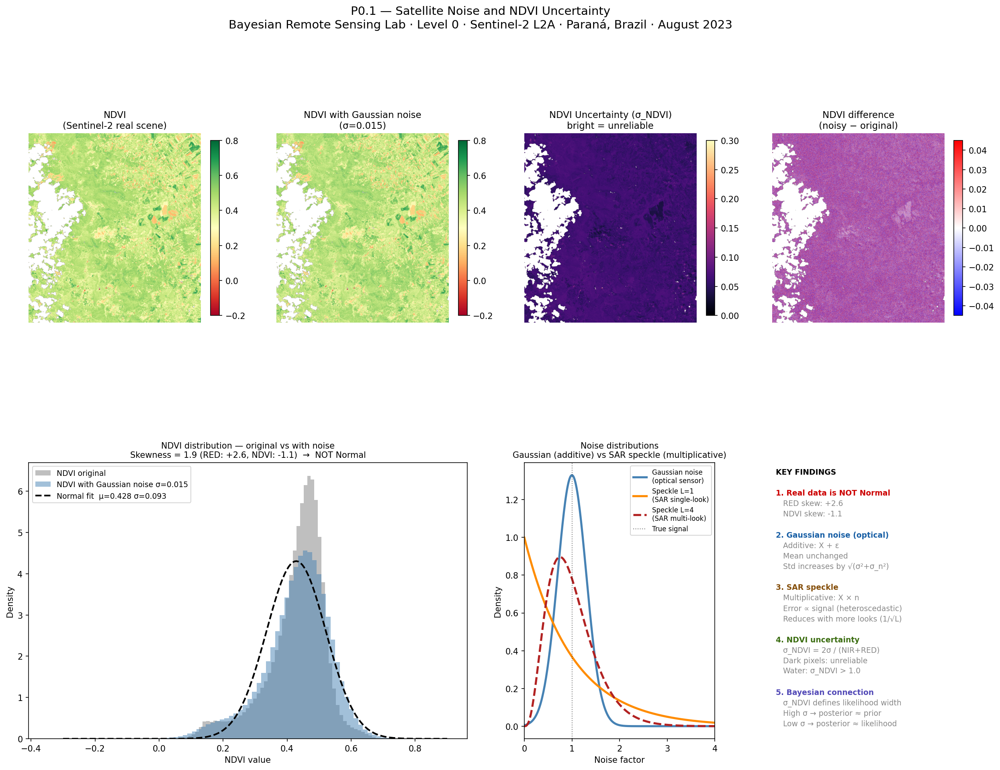
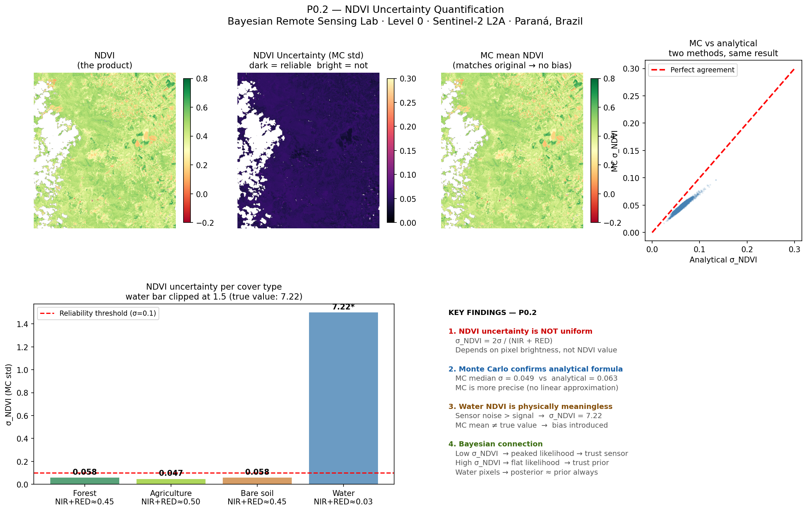

# Level 0 — Foundations
### Bayesian Remote Sensing Lab

---

## Overview

Before building any Bayesian model for Earth Observation, you need to answer two fundamental questions:

1. **How does sensor noise affect my data?** (P0.1)
2. **Where can I trust the derived products?** (P0.2)

This level builds the physical and statistical foundation for all subsequent projects.

---

## Projects

### P0.1 — Satellite Noise Simulation

**Question:** How does sensor noise alter satellite imagery and statistics?

**What we demonstrate:**
- Optical sensors (Sentinel-2) have additive Gaussian noise: `X_measured = X_true + ε, ε ~ N(0, σ²)`
- SAR sensors (Sentinel-1) have multiplicative speckle noise: `I_measured = I_true × n, n ~ Gamma(L, 1/L)`
- These are fundamentally different noise models requiring different likelihoods in Bayesian inference
- Real Sentinel-2 data does NOT follow a Normal distribution (RED skewness: +2.6, NDVI: -1.1)

**Key outputs:**



---

### P0.2 — NDVI Uncertainty Quantification

**Question:** Where can I trust the NDVI product?

**What we demonstrate:**
- NDVI uncertainty is not uniform — it depends on pixel brightness: `σ_NDVI = 2σ / (NIR + RED)`
- Dark pixels (water, shadows) have σ_NDVI > 1.0 — NDVI is physically meaningless there
- Monte Carlo simulation confirms the analytical formula
- This uncertainty map defines WHERE the Bayesian likelihood is informative

**Key outputs:**



---

## Connection to Bayesian Inference

| Concept | P0.1 | P0.2 |
|---------|------|------|
| Likelihood model | `N(X_true, σ²)` for optical | `σ_NDVI = 2σ/(NIR+RED)` |
| Key finding | SAR needs Gamma likelihood | Dark pixels → flat likelihood |
| Bayesian impact | Wrong likelihood = wrong posterior | High σ → posterior ≈ prior |

---

## Data

- **Sensor:** Sentinel-2 L2A
- **Date:** August 2023
- **Location:** Paraná, Brazil
- **Cloud cover:** < 5%
- **Source:** Microsoft Planetary Computer (free, no account)

---

## How to run

```bash
# Google Colab — recommended
# Open Bayesian_p1_p2.ipynb and run all cells
# Data downloads automatically from Planetary Computer
```

---

## Next: Level 1 — Bayesian Land Cover Classification

Using the likelihood models from P0.1 and the uncertainty maps from P0.2, Level 1 builds a full Bayesian classifier that assigns probability distributions to land cover classes.
